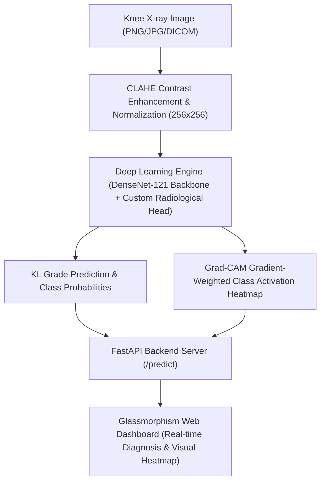

# ArthroScan AI - Deep Learning for Knee Osteoarthritis Detection & Severity Grading 🦴

An academic-grade, end-to-end medical AI solution designed to automatically detect and grade Knee Osteoarthritis from standard Knee Radiographs (X-rays) using **DenseNet-121 Deep Transfer Learning**, **CLAHE Image Enhancement**, **Grad-CAM Explainable AI**, and an interactive **FastAPI & Glassmorphism Web Application**.

Developed by **Nikita Tuteja** for the Final Year Engineering Project.

---

## 🌟 Key Project Highlights

- **Kellgren-Lawrence (KL) Severity Grading (Grade 0–4)**:
  - `Grade 0: Normal` — Healthy joint space, no osteophytes.
  - `Grade 1: Doubtful` — Possible joint space narrowing, minute osteophytes.
  - `Grade 2: Mild` — Definite small osteophytes, preserved joint space.
  - `Grade 3: Moderate` — Multiple moderate osteophytes, definite joint space loss.
  - `Grade 4: Severe` — Large osteophytes, severe bone-on-bone contact, subchondral sclerosis.
- **Explainable AI (Grad-CAM)**: Visual attention heatmaps highlight anatomical joint spaces and osteophyte regions directly on the radiograph for clinician transparency.
- **CLAHE Contrast Enhancement**: Adaptive Histogram Equalization sharpens subtle bone margins and cartilage contours.
- **Two-Stage Transfer Learning**: Feature warmup + deep layer fine-tuning with balanced class weighting.
- **Modern Web Application**: Interactive dark-mode glassmorphism interface with drag-and-drop X-ray upload, real-time inference, Grad-CAM heatmaps toggle, confidence bars, and scan history.
- **Comprehensive Academic Report Suite**: Automated generation of Confusion Matrices (counts + normalized %), Classification Reports (Precision/Recall/F1), and loss/accuracy curves.

---

## 🏗️ System Architecture



---

## 📁 Repository Structure

```
├── backend/
│   └── main.py                     # FastAPI REST API & prediction endpoints
├── src/
│   ├── model.py                    # DenseNet-121 architecture & 2-stage training engine
│   ├── preprocess.py               # CLAHE enhancement, dataset indexing, data generators
│   └── gradcam.py                  # Grad-CAM heatmap extraction & visual overlay
├── models/
│   ├── best_model_improved.keras   # High-accuracy DenseNet-121 model weights (256x256)
│   ├── best_model.keras            # MobileNetV2 baseline model
│   └── arthritis_model.h5          # Custom CNN baseline model
├── data_splits/
│   ├── train.csv                   # Stratified training split (70%)
│   ├── val.csv                     # Stratified validation split (15%)
│   └── test.csv                    # Stratified holdout test split (15%)
├── reports/
│   ├── confusion_matrix.png        # Publication-ready dual Confusion Matrix
│   ├── sample_gradcam_predictions.png # Grad-CAM explainability panel across 5 grades
│   ├── training_history.png        # Epoch-by-epoch loss & accuracy curves
│   ├── classification_report.txt   # Precision, recall, and F1 metrics summary
│   └── classification_report.csv   # Machine-readable evaluation report
├── full code/
│   └── Knee X-ray Images/          # MedicalExpert-I & II dataset (3,300 X-rays)
├── index.html                      # Interactive web interface layout
├── script.js                       # Frontend client & API communication logic
├── train.py                        # Complete model training script
├── evaluate.py                     # Academic evaluation & figure generator
├── requirements.txt                # Python dependencies
└── README.md                       # Project documentation
```

---

## 🚀 Quick Start Guide

### 1. Prerequisites
- Python **3.10** or **3.11** installed.

### 2. Environment Setup
```bash
# Clone the repository
git clone https://github.com/nikitatuteja/knee-arthritis-detection.git
cd knee-arthritis-detection

# Create and activate virtual environment
python -m venv venv

# On Windows PowerShell:
.\venv\Scripts\Activate.ps1

# On Linux/macOS:
source venv/bin/activate

# Install all dependencies
pip install --upgrade pip
pip install -r requirements.txt
```

### 3. Run the Web Application
```bash
python backend/main.py
```
Open your browser and navigate to: **`http://localhost:8000`**

- Upload any knee X-ray (e.g. from `full code/Knee X-ray Images/`).
- Click **"Start Deep Analysis"**.
- Toggle between **Original X-Ray** and **🔥 AI Heatmap (Grad-CAM)** to inspect model reasoning.

---

## 🧠 Training & Evaluation

### Train Model from Scratch / Fine-Tune:
```bash
python train.py --img_size 256 --batch_size 32 --warmup_epochs 5 --finetune_epochs 20
```

### Evaluate on Test Set & Generate Academic Deliverables:
```bash
python evaluate.py
```
This automatically produces all high-resolution figures in the `reports/` folder:
- **`reports/confusion_matrix.png`**: Raw sample counts and normalized recall percentages across all 5 KL grades.
- **`reports/sample_gradcam_predictions.png`**: Side-by-side comparison of Raw X-ray, CLAHE Preprocessed, and Grad-CAM Joint Localization.
- **`reports/classification_report.txt`**: Precision, Recall, and Macro/Weighted F1-Scores.

---

## 🌐 API Reference

| Endpoint | Method | Description |
|---|---|---|
| `/` | `GET` | Serves the interactive web interface (`index.html`). |
| `/health` | `GET` | Returns server health, active model status, and class labels. |
| `/predict` | `POST` | Accepts multipart image file (`file`) and returns predicted class, confidence, all 5 grade probabilities, and base64-encoded Grad-CAM heatmap. |

---

## 👤 Author
- **Nikita Tuteja** — [GitHub Profile](https://github.com/nikitatuteja)

---

## ⚠️ Disclaimer
*This project was developed for academic and engineering research purposes. It is intended to assist medical imaging research and is not a replacement for professional clinical radiological diagnosis.*
